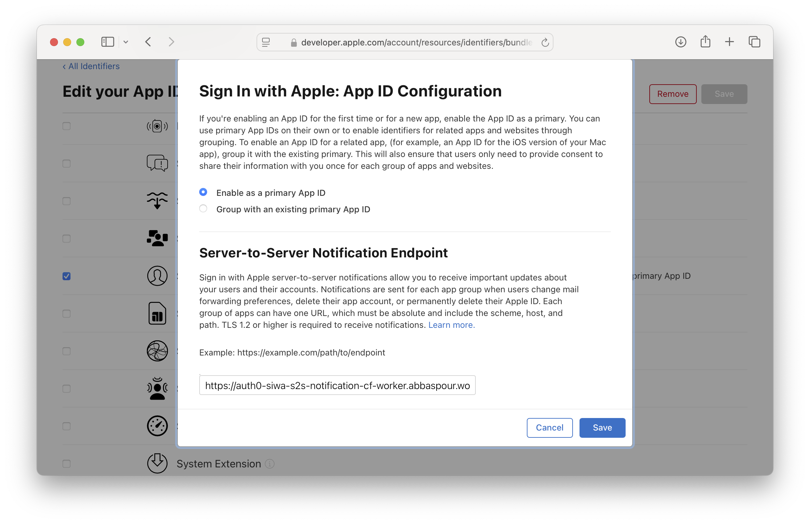
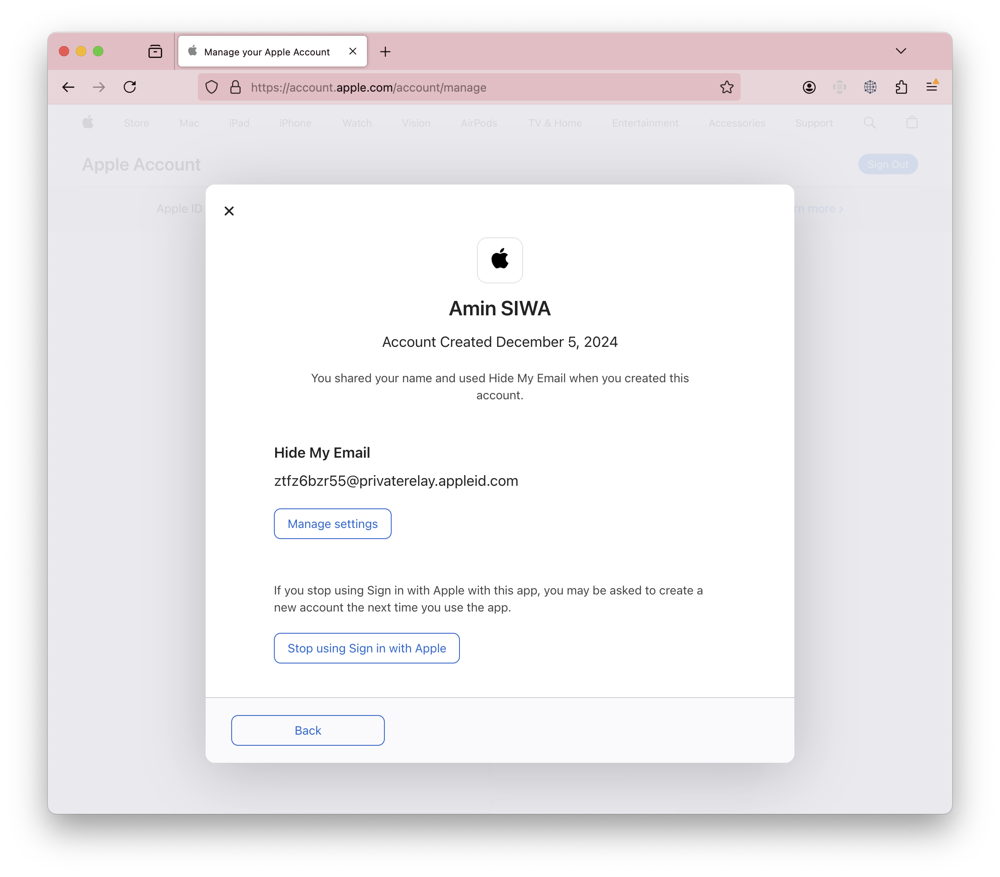

# Cloudflare Worker receives Apple's server-to-server notifications and updates users in Auth0

## Setup
Update [wrangler.toml](wrangler.toml) with your SIWA enabled Apple App's ID.

```bash
npm i
wrangler publish
```

Go to Apple Developer Account > Certificates, Identifiers & Profiles > App > Capabilities > Sign in with Apple > Configure/ Edit  
set worker URL inside Server-to-Server Notification Endpoint.



## How to generate events
In order to generate S2S events, go to your personal Apple ID account > Sign-In and Security > Sign in with Apple > App



see [sample events](./sample) payloads.

## References
* https://developer.apple.com/documentation/sign_in_with_apple/processing_changes_for_sign_in_with_apple_accounts
